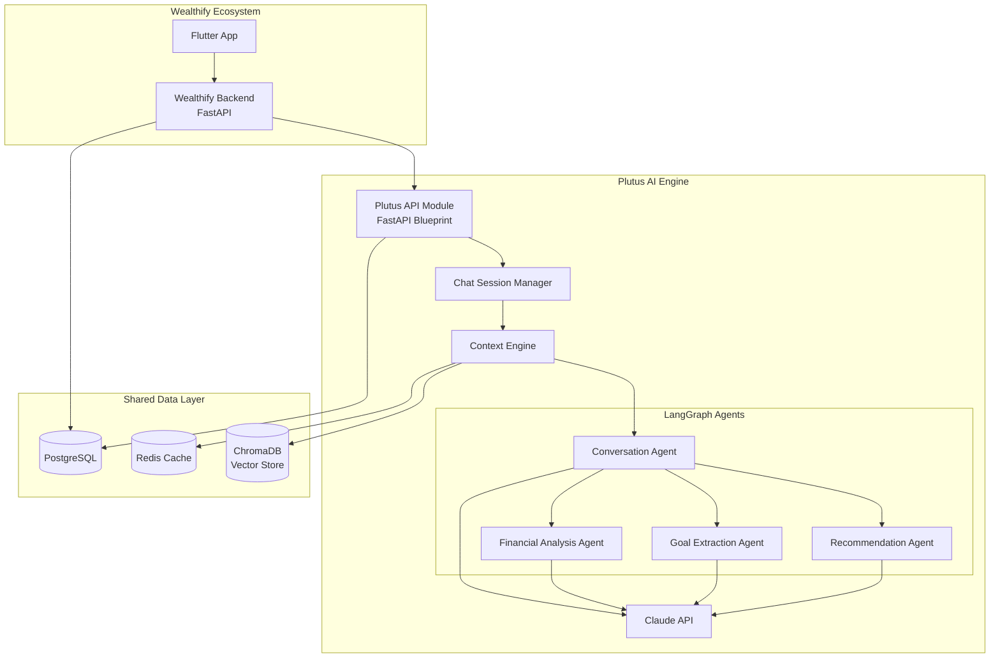

# Plutus Architecture - Aligned with Wealthify

## 🎯 Overview

Plutus is an AI-powered multiagent wealth building coach that integrates seamlessly with Wealthify's existing FastAPI backend. It provides intelligent conversational AI capabilities using LangGraph and Claude API while leveraging Wealthify's existing user data and financial integrations.

## 🏗️ Integration Architecture



## 📦 Implementation Strategy

### 1. **Integration as FastAPI Sub-Application**

Plutus will be integrated as a sub-application within Wealthify's existing FastAPI backend:

```python
# In Wealthify's unified_server.py
from plutus.api import plutus_router

# Mount Plutus endpoints
app.include_router(
    plutus_router,
    prefix="/api/v1/plutus",
    tags=["plutus", "ai", "chat"]
)
```

### 2. **Shared Authentication**

Leverage Wealthify's existing JWT authentication:

```python
# Plutus will use Wealthify's auth dependencies
from app.core.security import get_current_user
from app.models.user import User

@plutus_router.post("/chat/message")
async def send_message(
    message: ChatMessage,
    current_user: User = Depends(get_current_user)
):
    # Process with user context from Wealthify
    pass
```

### 3. **Database Schema Extension**

New tables for Plutus while respecting existing Wealthify schema:

```sql
-- Plutus-specific tables that reference Wealthify's users table
CREATE TABLE plutus_conversations (
    id UUID PRIMARY KEY DEFAULT gen_random_uuid(),
    user_id UUID NOT NULL REFERENCES users(id) ON DELETE CASCADE,
    session_id VARCHAR(255) NOT NULL,
    started_at TIMESTAMP WITH TIME ZONE DEFAULT NOW(),
    ended_at TIMESTAMP WITH TIME ZONE,
    summary TEXT,
    metadata JSONB,
    INDEX idx_plutus_conv_user (user_id),
    INDEX idx_plutus_conv_session (session_id)
);

CREATE TABLE plutus_messages (
    id UUID PRIMARY KEY DEFAULT gen_random_uuid(),
    conversation_id UUID REFERENCES plutus_conversations(id) ON DELETE CASCADE,
    role VARCHAR(50) NOT NULL, -- 'user', 'assistant', 'system'
    content TEXT NOT NULL,
    metadata JSONB,
    created_at TIMESTAMP WITH TIME ZONE DEFAULT NOW(),
    INDEX idx_plutus_msg_conv (conversation_id)
);

CREATE TABLE plutus_user_context (
    id UUID PRIMARY KEY DEFAULT gen_random_uuid(),
    user_id UUID NOT NULL REFERENCES users(id) ON DELETE CASCADE,
    context_version INTEGER NOT NULL,
    financial_snapshot JSONB,
    goals_snapshot JSONB,
    insights JSONB,
    preferences JSONB,
    created_at TIMESTAMP WITH TIME ZONE DEFAULT NOW(),
    UNIQUE(user_id, context_version),
    INDEX idx_plutus_ctx_user (user_id)
);

CREATE TABLE plutus_insights (
    id UUID PRIMARY KEY DEFAULT gen_random_uuid(),
    user_id UUID NOT NULL REFERENCES users(id) ON DELETE CASCADE,
    insight_type VARCHAR(100),
    content TEXT,
    confidence_score DECIMAL(3,2),
    source VARCHAR(50), -- 'conversation', 'account_analysis', 'goal_tracking'
    extracted_at TIMESTAMP WITH TIME ZONE DEFAULT NOW(),
    INDEX idx_plutus_insights_user (user_id),
    INDEX idx_plutus_insights_type (insight_type)
);
```

## 🔌 API Endpoints

Plutus endpoints integrated with Wealthify's API structure:

```python
# Plutus API endpoints under /api/v1/plutus/
POST   /api/v1/plutus/chat/start           # Start new chat session
POST   /api/v1/plutus/chat/message         # Send message
GET    /api/v1/plutus/chat/history         # Get chat history
DELETE /api/v1/plutus/chat/end             # End chat session

GET    /api/v1/plutus/context/current      # Get current user context
GET    /api/v1/plutus/context/history      # Get context versions
POST   /api/v1/plutus/context/refresh      # Force context refresh

GET    /api/v1/plutus/insights             # Get user insights
GET    /api/v1/plutus/recommendations      # Get recommendations
```

## 📊 Data Flow

### Context Building Flow:

```python
class PlutusContextBuilder:
    def build_user_context(self, user_id: UUID) -> UserContext:
        # 1. Fetch from Wealthify's existing tables
        user = await get_user(user_id)
        accounts = await get_accounts(user_id)
        balances = await get_account_balances(user_id)
        goals = await get_financial_goals(user_id)
        portfolio = await get_portfolio_holdings(user_id)
        
        # 2. Fetch from Plutus tables
        recent_conversations = await get_recent_conversations(user_id)
        previous_insights = await get_user_insights(user_id)
        
        # 3. Build comprehensive context
        context = {
            "user_profile": {
                "name": user.name,
                "risk_tolerance": user.risk_tolerance,
                "goals": [goal.to_dict() for goal in goals]
            },
            "financial_state": {
                "accounts": [acc.to_dict() for acc in accounts],
                "net_worth": calculate_net_worth(accounts, balances),
                "portfolio": portfolio_summary(portfolio)
            },
            "conversation_history": recent_conversations,
            "insights": previous_insights
        }
        
        return context
```

## 🤖 LangGraph Agent Implementation

### Agent Workflow:

```python
from langgraph.graph import StateGraph, END
from langchain_anthropic import ChatAnthropic

class PlutusAgentWorkflow:
    def __init__(self):
        self.llm = ChatAnthropic(model="claude-3-opus-20240229")
        self.workflow = self.build_workflow()
    
    def build_workflow(self):
        workflow = StateGraph(ConversationState)
        
        # Add nodes
        workflow.add_node("conversation", self.conversation_agent)
        workflow.add_node("financial_analysis", self.financial_analysis_agent)
        workflow.add_node("goal_extraction", self.goal_extraction_agent)
        workflow.add_node("recommendation", self.recommendation_agent)
        workflow.add_node("context_update", self.context_update_agent)
        
        # Add edges
        workflow.set_entry_point("conversation")
        workflow.add_conditional_edges(
            "conversation",
            self.route_conversation,
            {
                "analyze_finances": "financial_analysis",
                "discuss_goals": "goal_extraction",
                "get_advice": "recommendation",
                "end": END
            }
        )
        
        workflow.add_edge("financial_analysis", "context_update")
        workflow.add_edge("goal_extraction", "context_update")
        workflow.add_edge("recommendation", "context_update")
        workflow.add_edge("context_update", END)
        
        return workflow.compile()
```

## 🔄 Integration Points with Wealthify

### 1. **User Data Access**:
```python
# Plutus accesses Wealthify data through service layer
from app.services.financial_service_factory import get_accounts
from app.models.user import User
from app.models.financial import Account, FinancialGoal

class PlutusDataService:
    async def get_user_financial_data(self, user_id: UUID):
        # Use Wealthify's existing services
        accounts = await get_accounts(user_id)
        goals = await FinancialGoal.query.filter_by(user_id=user_id).all()
        return {"accounts": accounts, "goals": goals}
```

### 2. **Real-time Updates**:
```python
# Listen to Wealthify events
@event_handler("account_connected")
async def on_account_connected(event):
    user_id = event.user_id
    await plutus_context_service.refresh_financial_context(user_id)

@event_handler("transaction_categorized")
async def on_transaction_update(event):
    user_id = event.user_id
    await plutus_context_service.update_spending_patterns(user_id)
```

### 3. **Shared Configuration**:
```python
# Use Wealthify's config
from app.core.config import settings

PLUTUS_CONFIG = {
    "anthropic_api_key": settings.ANTHROPIC_API_KEY,
    "max_conversation_length": 100,
    "context_ttl_seconds": 3600,
    "vector_db_path": settings.CHROMA_PERSIST_DIR
}
```

## 🚀 Deployment Strategy

### Phase 1: Development Integration
1. Add Plutus as a Python package within Wealthify
2. Extend database with Plutus tables
3. Add API endpoints to existing FastAPI app
4. Test with existing authentication flow

### Phase 2: Production Deployment
1. Deploy as part of Wealthify's Docker container
2. Share Redis instance for caching
3. Use same PostgreSQL database
4. Monitor through existing infrastructure

## 📈 Performance Considerations

1. **Caching Strategy**:
   - Cache user context in Redis (TTL: 1 hour)
   - Cache Claude API responses (TTL: 5 minutes)
   - Use Wealthify's existing cache infrastructure

2. **Database Optimization**:
   - Partition plutus_messages by month
   - Index on user_id for all Plutus tables
   - Use JSONB for flexible schema evolution

3. **API Rate Limiting**:
   - Inherit Wealthify's rate limiting
   - Additional limits for Claude API calls
   - Queue long-running analyses

## 🔐 Security Alignment

1. **Authentication**: Use Wealthify's JWT tokens
2. **Authorization**: Respect existing RBAC
3. **Encryption**: Use Wealthify's encryption for sensitive data
4. **Audit Trail**: Log all AI interactions

## 📊 Monitoring & Observability

```python
# Integrate with Wealthify's monitoring
from app.core.logging import logger
from opentelemetry import trace

tracer = trace.get_tracer("plutus")

@tracer.start_as_current_span("plutus_chat_message")
async def process_message(message, user_id):
    logger.info(f"Processing Plutus message for user {user_id}")
    # Process message
    return response
```

## 🎯 Success Metrics

1. **Technical Metrics**:
   - API response time < 2s
   - Context build time < 500ms
   - Claude API success rate > 99%

2. **Business Metrics**:
   - User engagement with AI chat
   - Goal completion rates
   - Financial insight accuracy

This architecture ensures Plutus integrates seamlessly with Wealthify while providing powerful AI capabilities for wealth building guidance.