# Plutus Architecture - Aligned with Wealthify

## 🎯 Overview

Plutus is an AI-powered multiagent wealth building coach that integrates seamlessly with Wealthify's existing FastAPI backend. It provides intelligent conversational AI capabilities using LangGraph and Claude API while leveraging Wealthify's existing user data and financial integrations.

## 🏗️ Integration Architecture


## 📦 Implementation Strategy

### 1. **Integration as FastAPI Sub-Application**

Plutus will be integrated as a sub-application within Wealthify's existing FastAPI backend:

```python
# In Wealthify's unified_server.py
from plutus.api import plutus_router

# Mount Plutus endpoints
app.include_router(
    plutus_router,
    prefix="/api/v1/plutus",
    tags=["plutus", "ai", "chat"]
)
```

### 2. **Shared Authentication**

Leverage Wealthify's existing JWT authentication:

```python
# Plutus will use Wealthify's auth dependencies
from app.core.security import get_current_user
from app.models.user import User

@plutus_router.post("/chat/message")
async def send_message(
    message: ChatMessage,
    current_user: User = Depends(get_current_user)
):
    # Process with user context from Wealthify
    pass
```

### 3. **Database Schema Extension**

New tables for Plutus while respecting existing Wealthify schema:

```sql
-- Plutus-specific tables that reference Wealthify's users table
CREATE TABLE plutus_conversations (
    id UUID PRIMARY KEY DEFAULT gen_random_uuid(),
    user_id UUID NOT NULL REFERENCES users(id) ON DELETE CASCADE,
    session_id VARCHAR(255) NOT NULL,
    started_at TIMESTAMP WITH TIME ZONE DEFAULT NOW(),
    ended_at TIMESTAMP WITH TIME ZONE,
    summary TEXT,
    metadata JSONB,
    INDEX idx_plutus_conv_user (user_id),
    INDEX idx_plutus_conv_session (session_id)
);

CREATE TABLE plutus_messages (
    id UUID PRIMARY KEY DEFAULT gen_random_uuid(),
    conversation_id UUID REFERENCES plutus_conversations(id) ON DELETE CASCADE,
    role VARCHAR(50) NOT NULL, -- 'user', 'assistant', 'system'
    content TEXT NOT NULL,
    metadata JSONB,
    created_at TIMESTAMP WITH TIME ZONE DEFAULT NOW(),
    INDEX idx_plutus_msg_conv (conversation_id)
);

CREATE TABLE plutus_user_context (
    id UUID PRIMARY KEY DEFAULT gen_random_uuid(),
    user_id UUID NOT NULL REFERENCES users(id) ON DELETE CASCADE,
    context_version INTEGER NOT NULL,
    financial_snapshot JSONB,
    goals_snapshot JSONB,
    insights JSONB,
    preferences JSONB,
    created_at TIMESTAMP WITH TIME ZONE DEFAULT NOW(),
    UNIQUE(user_id, context_version),
    INDEX idx_plutus_ctx_user (user_id)
);

CREATE TABLE plutus_insights (
    id UUID PRIMARY KEY DEFAULT gen_random_uuid(),
    user_id UUID NOT NULL REFERENCES users(id) ON DELETE CASCADE,
    insight_type VARCHAR(100),
    content TEXT,
    confidence_score DECIMAL(3,2),
    source VARCHAR(50), -- 'conversation', 'account_analysis', 'goal_tracking'
    extracted_at TIMESTAMP WITH TIME ZONE DEFAULT NOW(),
    INDEX idx_plutus_insights_user (user_id),
    INDEX idx_plutus_insights_type (insight_type)
);
```

## 🔌 API Endpoints

Plutus endpoints integrated with Wealthify's API structure:

```python
# Plutus API endpoints under /api/v1/plutus/
POST   /api/v1/plutus/chat/start           # Start new chat session
POST   /api/v1/plutus/chat/message         # Send message
GET    /api/v1/plutus/chat/history         # Get chat history
DELETE /api/v1/plutus/chat/end             # End chat session

GET    /api/v1/plutus/context/current      # Get current user context
GET    /api/v1/plutus/context/history      # Get context versions
POST   /api/v1/plutus/context/refresh      # Force context refresh

GET    /api/v1/plutus/insights             # Get user insights
GET    /api/v1/plutus/recommendations      # Get recommendations
```

## 📊 Data Flow

### Context Building Flow:

```python
class PlutusContextBuilder:
    def build_user_context(self, user_id: UUID) -> UserContext:
        # 1. Fetch from Wealthify's existing tables
        user = await get_user(user_id)
        accounts = await get_accounts(user_id)
        balances = await get_account_balances(user_id)
        goals = await get_financial_goals(user_id)
        portfolio = await get_portfolio_holdings(user_id)
        
        # 2. Fetch from Plutus tables
        recent_conversations = await get_recent_conversations(user_id)
        previous_insights = await get_user_insights(user_id)
        
        # 3. Build comprehensive context
        context = {
            "user_profile": {
                "name": user.name,
                "risk_tolerance": user.risk_tolerance,
                "goals": [goal.to_dict() for goal in goals]
            },
            "financial_state": {
                "accounts": [acc.to_dict() for acc in accounts],
                "net_worth": calculate_net_worth(accounts, balances),
                "portfolio": portfolio_summary(portfolio)
            },
            "conversation_history": recent_conversations,
            "insights": previous_insights
        }
        
        return context
```

## 🤖 LangGraph Multi-Agent System

### Phase 3: Advanced Agent Network

Plutus implements a sophisticated multi-agent system using LangGraph that coordinates 5 specialized agents to provide comprehensive financial coaching.

```mermaid
graph TB
    %% Entry Point
    UserInput["👤 User Input"]
    
    %% Advanced Orchestrator
    subgraph Orchestrator ["🎯 Advanced Orchestrator"]
        RoutingAnalysis["📊 Routing Analysis"]
        ExecutionStrategy["⚡ Execution Strategy"]
    end
    
    %% Specialized Agents
    subgraph FinAgent ["🏦 Financial Analysis Agent"]
        FinAnalysis["💰 Financial Health Analysis"]
        FinInsights["📈 Financial Insights"]
    end
    
    subgraph GoalAgent ["🎯 Goal Extraction Agent"]
        GoalDetection["🔍 Goal Detection"]
        GoalTracking["📋 Goal Management"]
    end
    
    subgraph RiskAgent ["⚠️ Risk Assessment Agent"]
        RiskAnalysis["📊 Risk Profiling"]
        RiskMitigation["🛡️ Risk Mitigation"]
    end
    
    subgraph RecAgent ["💡 Recommendation Agent"]
        RecommendationEngine["🎯 Personalized Advice"]
        ActionPlans["📝 Action Plans"]
    end
    
    %% Memory & Context System
    subgraph Memory ["🧠 Memory Service"]
        ConversationMemory["💬 Conversation History"]
        UserInsights["💡 User Insights"]
        ProgressTracking["📈 Progress Tracking"]
    end
    
    %% External Services
    subgraph External ["🔌 External Services"]
        ClaudeAPI["🤖 Claude API"]
        WealthifyData["🏦 Wealthify Data"]
        MemoryDB["💾 Memory Database"]
    end
    
    %% Response Synthesis
    ResponseSynthesis["🔄 Response Synthesis"]
    FinalResponse["📤 Final Response"]
    
    %% Flow Connections
    UserInput --> RoutingAnalysis
    RoutingAnalysis --> ExecutionStrategy
    
    %% Routing to Agents
    ExecutionStrategy -.->|Financial Query| FinAnalysis
    ExecutionStrategy -.->|Goal Discussion| GoalDetection
    ExecutionStrategy -.->|Risk Inquiry| RiskAnalysis
    ExecutionStrategy -.->|Advice Request| RecommendationEngine
    
    %% Agent Internal Flows
    FinAnalysis --> FinInsights
    GoalDetection --> GoalTracking
    RiskAnalysis --> RiskMitigation
    RecommendationEngine --> ActionPlans
    
    %% Memory Integration
    FinInsights -.-> ConversationMemory
    GoalTracking -.-> UserInsights
    RiskMitigation -.-> ProgressTracking
    ActionPlans -.-> ConversationMemory
    
    %% External Service Connections
    FinAnalysis <--> ClaudeAPI
    GoalDetection <--> ClaudeAPI
    RiskAnalysis <--> ClaudeAPI
    RecommendationEngine <--> ClaudeAPI
    
    FinAnalysis <--> WealthifyData
    ConversationMemory <--> MemoryDB
    UserInsights <--> MemoryDB
    ProgressTracking <--> MemoryDB
    
    %% Response Generation
    FinInsights --> ResponseSynthesis
    GoalTracking --> ResponseSynthesis
    RiskMitigation --> ResponseSynthesis
    ActionPlans --> ResponseSynthesis
    ConversationMemory --> ResponseSynthesis
    
    ResponseSynthesis --> FinalResponse
    
    %% Styling
    classDef agentNode fill:#e1f5fe,stroke:#0277bd,stroke-width:2px
    classDef memoryNode fill:#f3e5f5,stroke:#7b1fa2,stroke-width:2px
    classDef externalNode fill:#e8f5e8,stroke:#2e7d32,stroke-width:2px
    classDef orchestratorNode fill:#fff3e0,stroke:#ef6c00,stroke-width:2px
    classDef responseNode fill:#fce4ec,stroke:#c2185b,stroke-width:2px
    
    class FinAnalysis,FinInsights,GoalDetection,GoalTracking,RiskAnalysis,RiskMitigation,RecommendationEngine,ActionPlans agentNode
    class ConversationMemory,UserInsights,ProgressTracking memoryNode
    class ClaudeAPI,WealthifyData,MemoryDB externalNode
    class RoutingAnalysis,ExecutionStrategy orchestratorNode
    class ResponseSynthesis,FinalResponse responseNode
```



### Advanced Workflow Patterns

#### 1. **Intelligent Routing System**

```python
class AdvancedOrchestrator:
    def __init__(self):
        self.routing_patterns = {
            "financial_analysis": {
                "keywords": ["financial health", "net worth", "portfolio", "balance"],
                "agents": ["financial_analysis"],
                "priority": "high"
            },
            "goal_planning": {
                "keywords": ["goal", "save for", "planning", "target"],
                "agents": ["goal_extraction", "recommendation"],
                "priority": "high"
            },
            "comprehensive_analysis": {
                "keywords": ["advice", "recommendation", "what should", "help me"],
                "agents": ["financial_analysis", "goal_extraction", "risk_assessment", "recommendation"],
                "priority": "medium"
            }
        }
    
    async def analyze_conversation_routing(self, user_message: str) -> Dict[str, Any]:
        # Intelligent agent selection based on conversation analysis
        # Returns optimal agent combination and execution strategy
        pass
```

#### 2. **Parallel Agent Execution**


#### 3. **LangGraph State Management**

```python
from langgraph.graph import StateGraph, END
from langgraph.checkpoint.sqlite import SqliteSaver

class PlutusWorkflow:
    def build_advanced_workflow(self):
        workflow = StateGraph(ConversationState)
        
        # Orchestration nodes
        workflow.add_node("analyze_routing", self.analyze_routing_node)
        workflow.add_node("coordinate_agents", self.coordinate_agents_node)
        
        # Specialized agent nodes
        workflow.add_node("financial_analysis", self.financial_analysis_node)
        workflow.add_node("goal_extraction", self.goal_extraction_node)
        workflow.add_node("risk_assessment", self.risk_assessment_node)
        workflow.add_node("generate_recommendations", self.recommendation_node)
        
        # Memory and synthesis nodes
        workflow.add_node("update_memory", self.memory_update_node)
        workflow.add_node("synthesize_response", self.synthesis_node)
        
        # Dynamic routing logic
        workflow.set_entry_point("analyze_routing")
        workflow.add_conditional_edges(
            "analyze_routing",
            self.route_conversation,
            {
                "financial_only": "financial_analysis",
                "goal_focused": "goal_extraction",
                "risk_focused": "risk_assessment",
                "comprehensive": "coordinate_agents",
                "end": END
            }
        )
        
        # Parallel execution paths
        workflow.add_edge("coordinate_agents", "financial_analysis")
        workflow.add_edge("coordinate_agents", "goal_extraction")
        workflow.add_edge("coordinate_agents", "risk_assessment")
        
        # Convergence and synthesis
        workflow.add_edge("financial_analysis", "generate_recommendations")
        workflow.add_edge("goal_extraction", "generate_recommendations")
        workflow.add_edge("risk_assessment", "generate_recommendations")
        workflow.add_edge("generate_recommendations", "update_memory")
        workflow.add_edge("update_memory", "synthesize_response")
        workflow.add_edge("synthesize_response", END)
        
        # Add persistent memory
        memory = SqliteSaver.from_conn_string(":memory:")
        return workflow.compile(checkpointer=memory)
```

### Agent Specialization Matrix

| Agent Type | Core Capabilities | Input Analysis | Output Generation | Claude Integration |
|------------|------------------|----------------|-------------------|-------------------|
| **Financial Analysis** | Net worth, cash flow, wealth scoring | Account data, transactions | Financial health assessment | Market analysis, trend interpretation |
| **Goal Extraction** | NLP goal detection, categorization | Natural language, context | Structured goal data | Goal validation, timeline suggestions |
| **Risk Assessment** | Multi-dimensional risk analysis | Portfolio, employment, debt | Risk score, mitigation strategies | Risk explanation, strategy refinement |
| **Recommendation** | Personalized advice generation | Complete financial picture | Actionable recommendations | Strategy optimization, rationale |
| **Memory Service** | Context persistence, learning | Conversation history, patterns | Insights, preferences | Pattern recognition, trend analysis |

### Conversation Flow Examples

#### Example 1: Goal-Focused Conversation
```
User: "I want to save $60,000 for a house down payment in 4 years"

🎯 Routing Decision: goal_planning
📋 Agents Activated: [goal_extraction, recommendation]

Goal Agent: Extracts house purchase goal ($60k, 4 years)
Recommendation Agent: Creates savings strategy ($1,250/month)

💡 Final Response: "I've noted your house purchase goal. To save $60,000 in 4 years, 
you'll need to save $1,250/month. Based on your current cash flow, I recommend..."
```

#### Example 2: Comprehensive Analysis
```
User: "What should I do with my finances?"

🎯 Routing Decision: comprehensive_analysis  
📋 Agents Activated: [financial_analysis, goal_extraction, risk_assessment, recommendation]

Financial Agent: Analyzes current financial health (Wealth Score: 78/100)
Goal Agent: Reviews existing goals and suggests new ones
Risk Agent: Assesses overall risk profile (Medium risk, 45/100)
Recommendation Agent: Synthesizes insights into actionable advice

💡 Final Response: "Your financial health is strong with a wealth score of 78/100. 
Your main areas for optimization are emergency fund building and tax-advantaged investing..."
```

### Performance Optimizations

#### 1. **Parallel Processing Architecture**
- Agents execute simultaneously when possible
- Shared context passed efficiently between agents
- Results aggregated without blocking

#### 2. **Memory-Driven Efficiency**
- Previous insights cached and reused
- Conversation context maintained across sessions
- Learning patterns reduce redundant analysis

#### 3. **Adaptive Complexity**
- Simple queries use fewer agents
- Complex queries leverage full agent network
- Processing scales with conversation complexity

This advanced multi-agent architecture enables Plutus to provide sophisticated, personalized financial coaching that adapts to each user's unique situation and needs.

## 🔄 Integration Points with Wealthify

### 1. **User Data Access**:
```python
# Plutus accesses Wealthify data through service layer
from app.services.financial_service_factory import get_accounts
from app.models.user import User
from app.models.financial import Account, FinancialGoal

class PlutusDataService:
    async def get_user_financial_data(self, user_id: UUID):
        # Use Wealthify's existing services
        accounts = await get_accounts(user_id)
        goals = await FinancialGoal.query.filter_by(user_id=user_id).all()
        return {"accounts": accounts, "goals": goals}
```

### 2. **Real-time Updates**:
```python
# Listen to Wealthify events
@event_handler("account_connected")
async def on_account_connected(event):
    user_id = event.user_id
    await plutus_context_service.refresh_financial_context(user_id)

@event_handler("transaction_categorized")
async def on_transaction_update(event):
    user_id = event.user_id
    await plutus_context_service.update_spending_patterns(user_id)
```

### 3. **Shared Configuration**:
```python
# Use Wealthify's config
from app.core.config import settings

PLUTUS_CONFIG = {
    "anthropic_api_key": settings.ANTHROPIC_API_KEY,
    "max_conversation_length": 100,
    "context_ttl_seconds": 3600,
    "vector_db_path": settings.CHROMA_PERSIST_DIR
}
```

## 🚀 Deployment Strategy

### Phase 1: Development Integration
1. Add Plutus as a Python package within Wealthify
2. Extend database with Plutus tables
3. Add API endpoints to existing FastAPI app
4. Test with existing authentication flow

### Phase 2: Production Deployment
1. Deploy as part of Wealthify's Docker container
2. Share Redis instance for caching
3. Use same PostgreSQL database
4. Monitor through existing infrastructure

## 📈 Performance Considerations

1. **Caching Strategy**:
   - Cache user context in Redis (TTL: 1 hour)
   - Cache Claude API responses (TTL: 5 minutes)
   - Use Wealthify's existing cache infrastructure

2. **Database Optimization**:
   - Partition plutus_messages by month
   - Index on user_id for all Plutus tables
   - Use JSONB for flexible schema evolution

3. **API Rate Limiting**:
   - Inherit Wealthify's rate limiting
   - Additional limits for Claude API calls
   - Queue long-running analyses

## 🔐 Security Alignment

1. **Authentication**: Use Wealthify's JWT tokens
2. **Authorization**: Respect existing RBAC
3. **Encryption**: Use Wealthify's encryption for sensitive data
4. **Audit Trail**: Log all AI interactions

## 📊 Monitoring & Observability

```python
# Integrate with Wealthify's monitoring
from app.core.logging import logger
from opentelemetry import trace

tracer = trace.get_tracer("plutus")

@tracer.start_as_current_span("plutus_chat_message")
async def process_message(message, user_id):
    logger.info(f"Processing Plutus message for user {user_id}")
    # Process message
    return response
```

## 🎯 Success Metrics

1. **Technical Metrics**:
   - API response time < 2s
   - Context build time < 500ms
   - Claude API success rate > 99%

2. **Business Metrics**:
   - User engagement with AI chat
   - Goal completion rates
   - Financial insight accuracy

This architecture ensures Plutus integrates seamlessly with Wealthify while providing powerful AI capabilities for wealth building guidance.