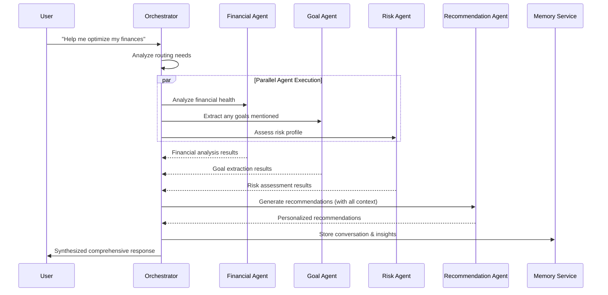

# Plutus 🧠

**AI-powered wealth management brain for financial advisory applications**

Plutus is a sophisticated multi-agent system that provides personalized financial advice using Claude AI and advanced orchestration.

## ✨ Features

- 🤖 **Multi-Agent Architecture**: Specialized agents for financial analysis, goal extraction, risk assessment, and recommendations
- 🧠 **Claude AI Integration**: Advanced reasoning and financial analysis capabilities
- 📊 **Comprehensive Testing**: 100-question test suite across multiple financial scenarios

## 🚀 Quick Start

```bash
# Install dependencies with UV
uv sync

# Run comprehensive test
uv run python test_plutus.py

# Import in your application
from plutus import PlutusOrchestrator, PlutusConfig

config = PlutusConfig()
orchestrator = PlutusOrchestrator()
result = await orchestrator.process({
    "user_message": "How much should I save for retirement?",
    "user_id": "user123",
    "user_context": {...}
})
```

## 🏗️ Architecture

- **Advanced Orchestrator**: Coordinates multiple specialized agents
- **Goal Extraction Agent**: Understands user financial objectives  
- **Risk Assessment Agent**: Evaluates risk tolerance and factors
- **Recommendation Agent**: Generates personalized financial advice
- **Financial Analysis Agent**: Processes financial data and metrics

## 📦 Installation

Requires Python 3.9+ and UV package manager:

```bash
pip install uv
git clone https://github.com/your-org/plutus.git
cd plutus
uv sync
```

## 🧪 Testing

Run the comprehensive test suite:

```bash
uv run python test_plutus.py
```

Tests include:
- Production readiness validation
- 100-question scenarios across 5 user profiles
- Multi-agent coordination verification
- Live response monitoring

## Setup

1. Create and activate virtual environment:
   ```bash
   python3 -m venv venv
   source venv/bin/activate  # On Windows: venv\Scripts\activate
   ```

2. Install dependencies:
   ```bash
   pip install -r requirements.txt
   ```

3. Copy and configure environment variables:
   ```bash
   cp .env.example .env
   # Edit .env with your API keys and configuration
   ```

4. Run the application:
   ```bash
   uvicorn src.main:app --reload
   ```

## Development

- **Code formatting**: `black src tests`
- **Linting**: `ruff check src tests`
- **Type checking**: `mypy src`
- **Testing**: `pytest tests/`

## 🤖 LangGraph Multi-Agent Architecture

Plutus implements a sophisticated multi-agent system using LangGraph that coordinates 5 specialized agents to provide comprehensive financial coaching.


### Agent Workflow Example



### Specialized Agents

| Agent | Purpose | Key Capabilities |
|-------|---------|------------------|
| **🏦 Financial Analysis** | Analyzes user's financial health and performance | Net worth calculation, cash flow analysis, wealth scoring |
| **🎯 Goal Extraction** | Identifies and manages financial goals from conversations | NLP goal detection, progress tracking, timeline analysis |
| **⚠️ Risk Assessment** | Evaluates financial risk across multiple dimensions | Portfolio risk, income stability, debt analysis |
| **💡 Recommendation** | Generates personalized financial advice and action plans | Investment strategies, debt management, tax optimization |
| **🧠 Memory Service** | Maintains conversation context and learns user preferences | Session continuity, insight extraction, progress tracking |

### Conversation Flow Examples

#### Simple Query → Single Agent
```
User: "What's my net worth?"
→ Routes to: Financial Analysis Agent
→ Response: Detailed net worth breakdown with insights
```

#### Complex Query → Multiple Agents
```
User: "I want to buy a house and optimize my investments"
→ Routes to: Goal Extraction + Risk Assessment + Recommendation Agents
→ Response: House purchase strategy + investment optimization plan
```

#### Learning Over Time
```
Session 1: User mentions retirement goals
→ Memory stores: User is focused on long-term planning

Session 2: "What should I invest in?"
→ Memory recalls: Previous retirement focus
→ Response: Retirement-optimized investment recommendations
```

